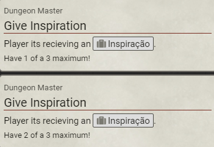
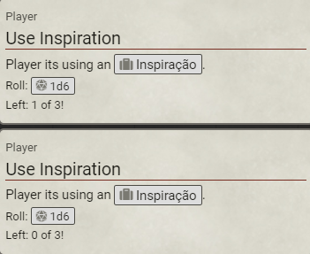

# Inspiration mechanic

It is a mechanic that I took from another RPG and adapted to my scenario.  

The objective was to reward my players when they had a good interpretation based on their Character.

When used the player needs to roll a die with six sides and sum on their test - d20 + attributes + inspiration (d6).

## Give Inspiration

## Use Inspiration

